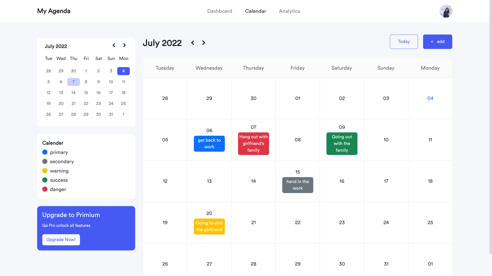

# MyAgenda

MyAgenda is a day planner application that is available for browsing. The application displays a free online calendar with the user's entire routine, and allows the user to add important events, reminders to do, and even desired activities.

## Available Scripts

In the project directory, you can run:

### `npm install`

Npm is a package manager for Node (Node Package Manager - npm) where the dependencies for package execution in node are installed allowing them to run. When we give npm install in a project it is because we need to use some dependencies that we don't have access to yet and that the package file.

### `npm start`

Runs the app in the development mode.\
Open [http://localhost:3000](http://localhost:3000) to view it in your browser.

The page will reload when you make changes.\
You may also see any lint errors in the console.

